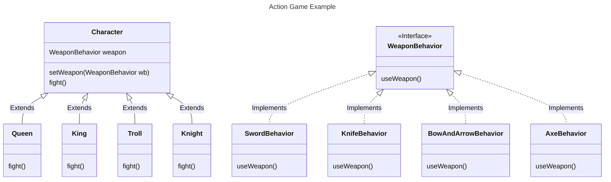

This is the UML from chapter 1 Design Puzzle

```mermaid
---
title: Action Game Example
---
classDiagram


class Character {
    WeaponBehavior weapon
    setWeapon(WeaponBehavior wb)
    fight()
}

class Queen {
    fight()
}

class King {
    fight()
}

class Knight {
    fight()
}

class Troll {
    fight()
}


class WeaponBehavior {
    <<Interface>>

    useWeapon()
}

class SwordBehavior {
    useWeapon()
}

class BowAndArrowBehavior {
    useWeapon()
}

class KnifeBehavior {
    useWeapon()
}

class AxeBehavior {
    useWeapon()
}

Character <|-- Queen : Extends
Character <|-- King : Extends
Character <|-- Troll : Extends
Character <|-- Knight:  Extends


WeaponBehavior <|.. SwordBehavior : Implements
WeaponBehavior <|.. KnifeBehavior : Implements
WeaponBehavior <|.. BowAndArrowBehavior : Implements
WeaponBehavior <|.. AxeBehavior : Implements
```
