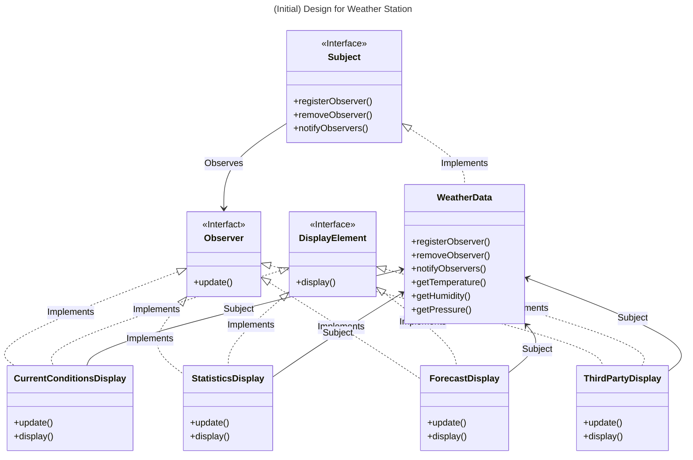

```mermaid
---
title: (Initial) Design for Weather Station
---
classDiagram

class Subject {
    <<Interface>>
    +registerObserver()
    +removeObserver()
    +notifyObservers()
}

class WeatherData {
    +registerObserver()
    +removeObserver()
    +notifyObservers()

    +getTemperature()
    +getHumidity()
    +getPressure()
}

Subject <|.. WeatherData : Implements


class Observer {
    <<Interfact>>
    +update()
}

class DisplayElement {
    <<Interface>>
    +display()
}

class CurrentConditionsDisplay {
    +update()
    +display()
}

class StatisticsDisplay {
    +update()
    +display()
}

class ForecastDisplay {
    +update()
    +display()
}

class ThirdPartyDisplay {
    +update()
    +display()
}

Observer <|.. CurrentConditionsDisplay: Implements
Observer <|.. StatisticsDisplay: Implements
Observer <|.. ForecastDisplay: Implements
Observer <|.. ThirdPartyDisplay: Implements

DisplayElement <|.. CurrentConditionsDisplay: Implements
DisplayElement <|.. StatisticsDisplay: Implements
DisplayElement <|.. ForecastDisplay: Implements
DisplayElement <|.. ThirdPartyDisplay: Implements

Subject --> Observer: Observes

WeatherData <-- CurrentConditionsDisplay: Subject
WeatherData <-- StatisticsDisplay: Subject
WeatherData <-- ForecastDisplay: Subject
WeatherData <-- ThirdPartyDisplay: Subject

```
